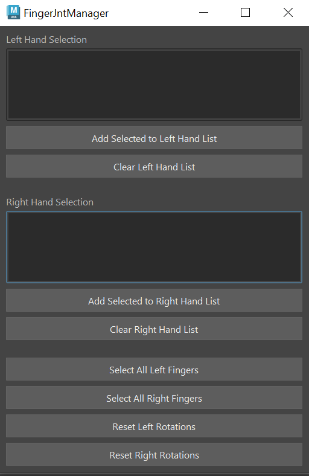

# Maya Plugin:Finger Manager

# How to install
Drag the install.mel file into Maya's viewport, the tool will appear on the current shelf
Access Maya's console and input sys.path.append("INSERT FILE PATH TO src HERE")

## Finger Joint Manager

A tool to help in the animation process by allowing the selection of joints and reseting of them.
* Contains two lists for the left and right fingers
* Contains buttons to add to the list and clear
* Contains buttons to select all joints in their respective list, allows for ease of animating multiple things at once
* Contains buttons to reset the joint's rotation values in the respective list, allows for ease getting joints into a new pose relative to the default pose

Potential additonal applications outside regular use
* Manager can also be used to affect only certain joints since the tool works as long as something is in the list, so can work well in just animating only one set of joints
* Can accept other objects as well so can be used to help animate multiple objects and not just joints

